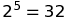

# Implement a Planning Search
--

<div style="text-align:center"></div> 

###Goal:

* Build a planning search agent that solves deterministic logistics planning problems for an Air Cargo transport system
* Implement progression search algorithms like those described in the navigation problem from lectures
* Compute optimal plans for each problems described below
* Implement domain-independent heuristics to aid the agent

### Repo Structure: 
* [`my_air_cargo_problems.py`](my_air_cargo_problems.py): search functions and heuristic functions to solve the logistic problems
* [`my_planning_graph.py`](my_planning_graph.py): code to create planning graph and nodes to represent logistic problems
* [`lp_utils.py`](lp_utils.py): utility functions and classes for FluentStates
* [`run_search.py`](run_search.py): provided for gathering metrics for various search methods on any or all of the problems
* [`./aimacode/`](./aimacode/): companion code from Stuart Russel/Norvig AIMA text
* [`./tests/`](./tests/): `unittest` test cases
* [`./writeup/`](./writeup/): heuristic analysis and images for writeup, notes for Chapter 10 of AIMA
* [`./research_review/`](./research_review/): Review of important historical developments in the field of AI planning and search

### Dependencies

* **Python 3.4** or higher.

  * Recommended install: [Anaconda](https://www.continuum.io/downloads), a pre-packaged Python distribution that contains all of the necessary libraries and software for this project. 

---

## Project Details
### Part 1 - Planning Problems

#### GIVEN: Classical PDDL Problems

All problems are in the Air Cargo domain.  They have the same action schema defined, but different initial states and goals.

- Air Cargo Action Schema:
```
Action(Load(c, p, a),
	PRECOND: At(c, a) ∧ At(p, a) ∧ Cargo(c) ∧ Plane(p) ∧ Airport(a)
	EFFECT: ¬ At(c, a) ∧ In(c, p))
Action(Unload(c, p, a),
	PRECOND: In(c, p) ∧ At(p, a) ∧ Cargo(c) ∧ Plane(p) ∧ Airport(a)
	EFFECT: At(c, a) ∧ ¬ In(c, p))
Action(Fly(p, from, to),
	PRECOND: At(p, from) ∧ Plane(p) ∧ Airport(from) ∧ Airport(to)
	EFFECT: ¬ At(p, from) ∧ At(p, to))
```

- Problem 1 initial state and goal:
```
Init(At(C1, SFO) ∧ At(C2, JFK) 
	∧ At(P1, SFO) ∧ At(P2, JFK) 
	∧ Cargo(C1) ∧ Cargo(C2) 
	∧ Plane(P1) ∧ Plane(P2)
	∧ Airport(JFK) ∧ Airport(SFO))
Goal(At(C1, JFK) ∧ At(C2, SFO))
```
- Problem 2 initial state and goal:
```
Init(At(C1, SFO) ∧ At(C2, JFK) ∧ At(C3, ATL) 
	∧ At(P1, SFO) ∧ At(P2, JFK) ∧ At(P3, ATL) 
	∧ Cargo(C1) ∧ Cargo(C2) ∧ Cargo(C3)
	∧ Plane(P1) ∧ Plane(P2) ∧ Plane(P3)
	∧ Airport(JFK) ∧ Airport(SFO) ∧ Airport(ATL))
Goal(At(C1, JFK) ∧ At(C2, SFO) ∧ At(C3, SFO))
```
- Problem 3 initial state and goal:
```
Init(At(C1, SFO) ∧ At(C2, JFK) ∧ At(C3, ATL) ∧ At(C4, ORD) 
	∧ At(P1, SFO) ∧ At(P2, JFK) 
	∧ Cargo(C1) ∧ Cargo(C2) ∧ Cargo(C3) ∧ Cargo(C4)
	∧ Plane(P1) ∧ Plane(P2)
	∧ Airport(JFK) ∧ Airport(SFO) ∧ Airport(ATL) ∧ Airport(ORD))
Goal(At(C1, JFK) ∧ At(C3, JFK) ∧ At(C2, SFO) ∧ At(C4, SFO))
```

#### The following methods and functions in [`my_air_cargo_problems.py`](./my_air_cargo_problems.py) were implemented to solve the problems above:
- `AirCargoProblem.get_actions` method including `load_actions` and `unload_actions` sub-functions
- `AirCargoProblem.actions` method
- `AirCargoProblem.result` method
- `air_cargo_p2` function
- `air_cargo_p3` function

#### Uninformed Planning Search Experiment:
* Uninformed planning searches for `air_cargo_p1`, `air_cargo_p2`, and `air_cargo_p3` were run and documented in [heuristic_analysis.pdf](./writeup/heuristic_analysis.pdf)
* Use the `run_search` script for data collection: from the command line type `python run_search.py -h` to learn more.

>#### Framing the Problem 
>Progression planning problems can be 
solved with graph searches such as breadth-first, depth-first, and A*, where the 
nodes of the graph are "states" and edges are "actions".  A "state" is the logical 
conjunction of all boolean ground "fluents", or state variables, that are possible 
for the problem using Propositional Logic. For example, we might have a problem to 
plan the transport of one cargo, C1, on a
single available plane, P1, from one airport to another, SFO to JFK.

In this simple example, there are five fluents, or state variables, which means our state 
space could be as large as . Note the following:
>- While the initial state defines every fluent explicitly, in this case mapped to **TTFFF**, the goal may 
be a set of states.  Any state that is `True` for the fluent `At(C1,JFK)` meets the goal.
>- Even though PDDL uses variable to describe actions as "action schema", these problems
are not solved with First Order Logic.  They are solved with Propositional logic and must
therefore be defined with concrete (non-variable) actions
and literal (non-variable) fluents in state descriptions.
>- The fluents here are mapped to a simple string representing the boolean value of each fluent
in the system, e.g. **TTFFTT...TTF**.  This will be the state representation in 
the `AirCargoProblem` class and is compatible with the `Node` and `Problem` 
classes, and the search methods in the AIMA library.  


### Part 2 - Domain-Independent Heuristics

#### The following heuristic method was implemented in [`my_air_cargo_problems.py`](./my_air_cargo_problems.py)
- `AirCargoProblem.h_ignore_preconditions` method

#### The following automatic heuristics were implemented in [`my_planning_graph.py`](./my_planning_graph.py):
- `PlanningGraph.add_action_level` method
- `PlanningGraph.add_literal_level` method
- `PlanningGraph.inconsistent_effects_mutex` method
- `PlanningGraph.interference_mutex` method
- `PlanningGraph.competing_needs_mutex` method
- `PlanningGraph.negation_mutex` method
- `PlanningGraph.inconsistent_support_mutex` method
- `PlanningGraph.h_levelsum` method


#### A* Search Experiment:
* A* planning searches were run using the heuristics implemented on `air_cargo_p1`, `air_cargo_p2` and `air_cargo_p3` and documented in [heuristic_analysis.pdf](./writeup/heuristic_analysis.pdf).  
* Use the `run_search` script for data collection: from the command line type `python run_search.py -h` to learn more.

>#### Background Information: Planning Graph
>The planning graph is somewhat complex, but is useful in planning because it is a polynomial-size approximation of the exponential tree that represents all possible paths. The planning graph can be used to provide automated admissible heuristics for any domain.  It can also be used as the first step in implementing GRAPHPLAN, a direct planning algorithm that you may wish to learn more about on your own (but we will not address it here).

>*Planning Graph example from the AIMA book*
>

## Testing:
- The `tests` directory includes `unittest` test cases that were used to evaluate the implementations. 
- To run:
    - `python -m unittest tests.test_my_air_cargo_problems`
    - `python -m unittest tests.test_my_planning_graph`
- The `run_search` script is provided for gathering metrics for various search methods on any or all of the problems
