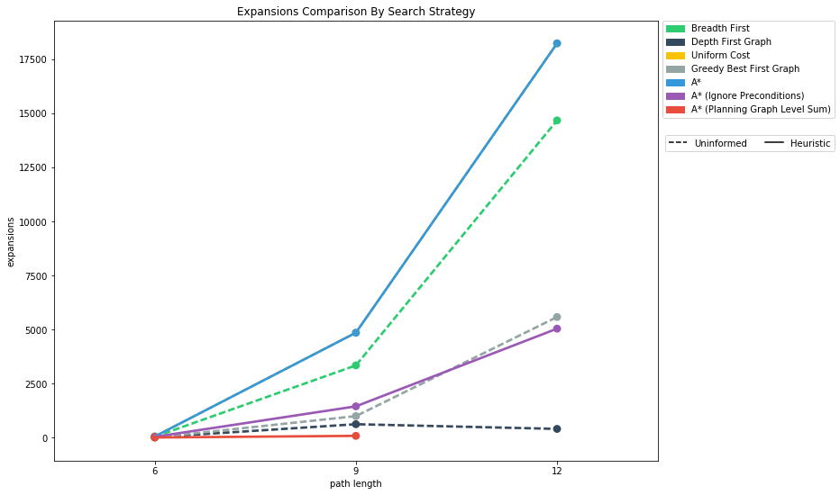
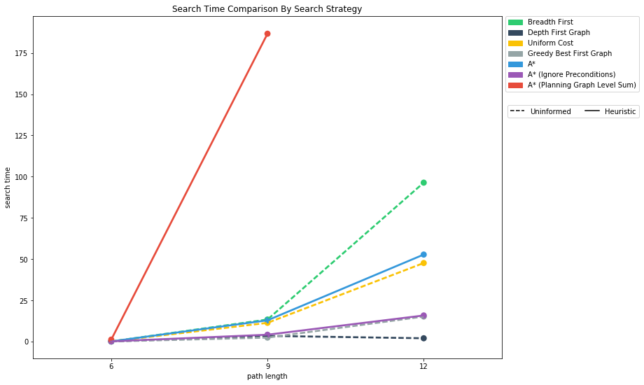

# Planning Search Heuristic Analysis

## Introduction
This project involved defining a group of problems in classical PDDL (Planning Domain Definition Language) for the Air Cargo domain. The goal is to develop a planning search agent that solves a deterministic logic problem for an Air Cargo transport system. The agent uses both uninformed non-heuristic searches (breadth-first, depth-first) and domain-independent heuristic based search strategies (A* search). 

The following metrics will be used to compare each strategy:

  * Optimal path length
  * Search time
  * Memory usage

### Action Schema

All problems are in the Air Cargo domain.  They have the same action schema defined, but different initial states and goals.

```
Action(Load(c, p, a),
	PRECOND: At(c, a) ∧ At(p, a) ∧ Cargo(c) ∧ Plane(p) ∧ Airport(a)
	EFFECT: ¬ At(c, a) ∧ In(c, p))
Action(Unload(c, p, a),
	PRECOND: In(c, p) ∧ At(p, a) ∧ Cargo(c) ∧ Plane(p) ∧ Airport(a)
	EFFECT: At(c, a) ∧ ¬ In(c, p))
Action(Fly(p, from, to),
	PRECOND: At(p, from) ∧ Plane(p) ∧ Airport(from) ∧ Airport(to)
	EFFECT: ¬ At(p, from) ∧ At(p, to))
```

## Problem 1 

**Initial state and goal:**

```
Init(At(C1, SFO) ∧ At(C2, JFK) 
	∧ At(P1, SFO) ∧ At(P2, JFK) 
	∧ Cargo(C1) ∧ Cargo(C2) 
	∧ Plane(P1) ∧ Plane(P2)
	∧ Airport(JFK) ∧ Airport(SFO))
Goal(At(C1, JFK) ∧ At(C2, SFO))
```

**Optimal plan:**

```
Load(C1, P1, SFO)
Load(C2, P2, JFK)
Fly(P1, SFO, JFK)
Fly(P2, JFK, SFO)
Unload(C1, P1, JFK)
Unload(C2, P2, SFO)
```

**Metric comparison by strategy:**

| Strategy | Type | Optimal | Expansions | Goal Tests | New Nodes | Plan Length | Search Time(s) | 
|:--:|:--:|:--:|:--:|:--:|:--:|:--:|:--:|
|Breadth First Search| Uninformed | Yes | 43 | 56 | 180 | 6 | 0.028 
|Breadth First Tree Search| Uninformed | Yes | 1458 | 1459 | 5960 | 6 | 0.901
|Depth First Graph Search | Uninformed | No | 21 | 22 | 84 | 20 | 0.018
|Depth Limited Search | Uninformed | No | 101 | 271 | 414 | 50 | 0.086
|Uniform Cost Search | Uninformed | Yes | 55 | 57 | 224 | 6 | 0.034
|Recursive Best First Search | Uninformed | Yes | 4229 | 4230 | 17023 | 6 | 2.586
|<span style="color:green">**Greedy Best First Graph Search**</span> | <span style="color:green">**Uninformed**</span> |<span style="color:green">**Yes**</span>|<span style="color:green">**7**</span>|<span style="color:green">**9**</span>|<span style="color:green">**28**</span>|<span style="color:green">**6**</span>|<span style="color:green">**0.004**</span>
|A* Search| Heuristic | Yes | 55 | 57 | 224 | 6 | 0.035
|A* Search (Ignore Preconditions) | Heuristic | Yes | 41 | 43 | 170 | 6 | 0.067
|A* Search (PlanningGraph Levelsum) | Heuristic | Yes | 11 | 13 | 50 | 6 | 1.123

**Note:** The dashed lines (**\-**) mean that the strategy exceeded 10 minutes and were unable to find a solution. The bolded strategy is the one that found an optimal solution the fastest. 

Five out of seven uninformed strategies (Breadth First, Breadth First Tree, Uniform Cost, Recursive Best, Greedy Best First) and all the heuristic strategies found the optimal solution of a plan length of 6. Greedy Best First Graph found the optimal solution the fastest and with the lowest memory consumption. 

## Problem 2 

**Initial state and goal:**

```
Init(At(C1, SFO) ∧ At(C2, JFK) ∧ At(C3, ATL) 
	∧ At(P1, SFO) ∧ At(P2, JFK) ∧ At(P3, ATL) 
	∧ Cargo(C1) ∧ Cargo(C2) ∧ Cargo(C3)
	∧ Plane(P1) ∧ Plane(P2) ∧ Plane(P3)
	∧ Airport(JFK) ∧ Airport(SFO) ∧ Airport(ATL))
Goal(At(C1, JFK) ∧ At(C2, SFO) ∧ At(C3, SFO))
```

**Optimal plan:**

```
Load(C3, P3, ATL)
Fly(P3, ATL, SFO)
Unload(C3, P3, SFO)
Load(C2, P2, JFK)
Fly(P2, JFK, SFO)
Unload(C2, P2, SFO)
Load(C1, P1, SFO)
Fly(P1, SFO, JFK)
Unload(C1, P1, JFK)
```

**Metric comparison by strategy:**

| Strategy | Type | Optimal | Expansions | Goal Tests | New Nodes | Plan Length | Search Time(s) | 
|:--:|:--:|:--:|:--:|:--:|:--:|:--:|:--:|
|Breadth First Search| Uninformed | Yes | 3343 | 4609 | 30509 | 9 | 13.320
|Breadth First Tree Search| Uninformed | - | - | - | - | - | -
|Depth First Graph Search | Uninformed | No | 624 | 625 | 5602 | 619 | 3.391
|Depth Limited Search | Uninformed | - | - | - | - | - | -
|Uniform Cost Search | Uninformed | Yes | 4853 | 4855 | 44041 | 9 | 11.299
|Recursive Best First Search | Uninformed | - | - | - | - | - | -
|Greedy Best First Graph Search | Uninformed | No | 998 | 1000 | 8962 | 21 | 2.344
|A* Search| Heuristic | Yes | 4853 | 4855 | 44041 | 9 | 12.841
|<span style="color:green">**A* Search (Ignore Preconditions)**</span> | <span style="color:green">**Heuristic**</span> |<span style="color:green">**Yes**</span> |<span style="color:green">**1450**</span> | <span style="color:green">**1452**</span> | <span style="color:green">**13303**</span> |<span style="color:green">**9**</span> | <span style="color:green">**4.102**</span>
|A* Search (PlanningGraph Levelsum) | Heuristic | Yes | 86 | 88 | 841 | 9 | 186.723

**Note:** The dashed lines (**\-**) mean that the strategy exceeded 10 minutes and were unable to find a solution. The bolded strategy is the one that found an optimal solution the fastest. 

Two out of seven uninformed strategies (Breadth First, Uniform Cost) and all heuristic strategies found the optimal solution of length 9. Breadth First Tree, Depth Limited, Recursive Best First were unable to find a solution within 10 minutes. The A* Search with Ignore Precondtions found the optimal solution almost the fastest but with the lowest memory computation. 

## Problem 3 

**Initial state and goal:**

```
Init(At(C1, SFO) ∧ At(C2, JFK) ∧ At(C3, ATL) ∧ At(C4, ORD) 
	∧ At(P1, SFO) ∧ At(P2, JFK) 
	∧ Cargo(C1) ∧ Cargo(C2) ∧ Cargo(C3) ∧ Cargo(C4)
	∧ Plane(P1) ∧ Plane(P2)
	∧ Airport(JFK) ∧ Airport(SFO) ∧ Airport(ATL) ∧ Airport(ORD))
Goal(At(C1, JFK) ∧ At(C3, JFK) ∧ At(C2, SFO) ∧ At(C4, SFO))
```

**Optimal plan:**

```
Load(C2, P2, JFK)
Fly(P2, JFK, ORD)
Load(C4, P2, ORD)
Fly(P2, ORD, SFO)
Unload(C4, P2, SFO)
Load(C1, P1, SFO)
Fly(P1, SFO, ATL)
Load(C3, P1, ATL)
Fly(P1, ATL, JFK)
Unload(C3, P1, JFK)
Unload(C2, P2, SFO)
Unload(C1, P1, JFK)
```

**Metric comparison by strategy:**

| Strategy | Type | Optimal | Expansions | Goal Tests | New Nodes | Plan Length | Search Time(s) | 
|:--:|:--:|:--:|:--:|:--:|:--:|:--:|:--:|
|Breadth First Search| Uninformed | Yes | 14663 | 18098 | 129631 | 12 | 96.356 
|Breadth First Tree Search| Uninformed | - | - | - | - | - | -
|Depth First Graph Search | Uninformed | No | 408 | 409 | 3364 | 392 | 1.950
|Depth Limited Search | Uninformed | - | - | - | - | - | -
|Uniform Cost Search | Uninformed | Yes | 18223 | 18225 | 159618 | 12 | 47.596
|Recursive Best First Search | Uninformed | - | - | - | - | - | -
|Greedy Best First Graph Search | Uninformed | No | 5578 | 5580 | 49150 | 22 |15.126
|A* Search| Heuristic | Yes | 18223 | 18225 | 159618 | 12 | 52.729
|<span style="color:green">**A* Search (Ignore Preconditions)**</span> | <span style="color:green">**Heuristic**</span> | <span style="color:green">**Yes**</span> | <span style="color:green">**5040**</span> | <span style="color:green">**5042**</span> | <span style="color:green">**44944**</span> | <span style="color:green">**12**</span> | <span style="color:green">**15.788**</span>
|A* Search (PlanningGraph Levelsum) | Heuristic | - | - | - | - | - | -

**Note:** The dashed lines (**\-**) mean that the strategy exceeded 10 minutes and were unable to find a solution. The bolded strategy is the one that found an optimal solution the fastest. 

Two out of seven uninformed strategies (Breadth First, Uniform Cost) and two out of three heuristic strategies found optimal solutions with length 12. Breadth First, Depth Limited, and Recursive Best First were unable to find a solution within 10 minutes. The A* Search with Ignore Preconditions found an optimal plan with one of the fastest times and lowest memory computations.

## Discussion

You can see from the plots below as problem complexity and path length increase, the time and memory space required to find the optimal solution also increases (regardless of the strategy). 

</img>

</img>

A quick glance across the tables and plots show that heuristic strategies almost always outperform uninformed strategies as complexity increases. If the solution requires a quick search and memory space is not a concern then an A* Search (especially the **A* Search Ignoring Preconditions**) appears to be the best strategy based on the three problems. Although it appears Depth First Graph performs well in regards to memory and time, it did not find the optimal solution in any of the problems. 

Overall, if the problem is less complex it might be easier to start with an uninformed search like Greedy Best First Graph Search or Breadth First Search because they will be relatively fast and find the optimal solution. As the complexity increases, you should consider switching to a heuristic based search like an A* Search.