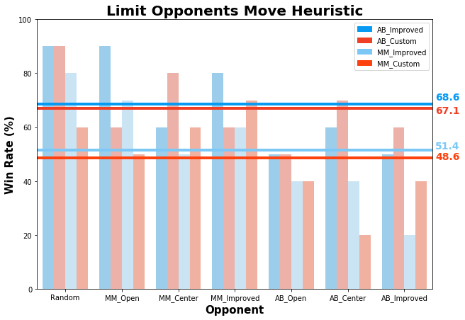
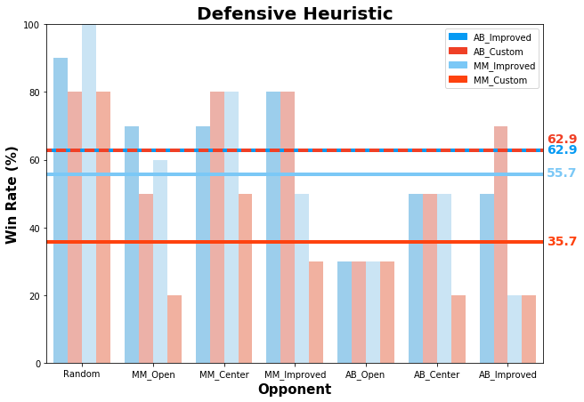
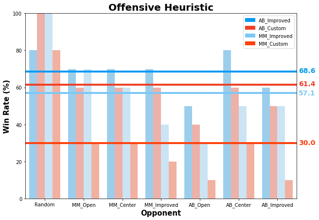
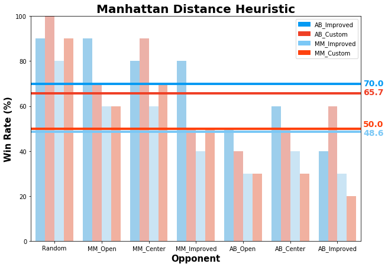
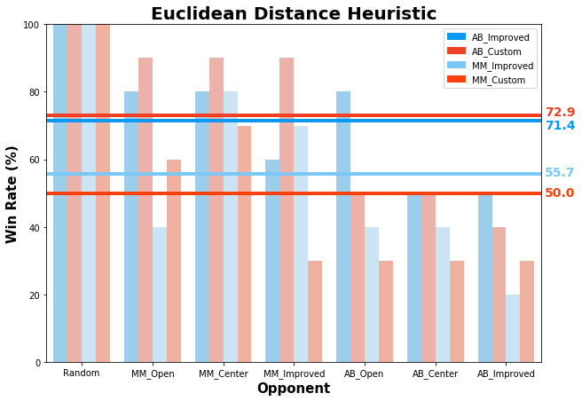
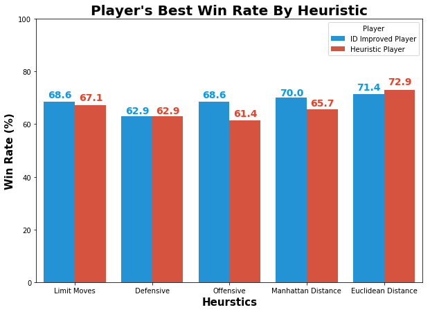

# Isolation Heuristic Analysis

## Introduction
A game playing agent was developed to search the Isolation game tree and find the best possible move using **minimax algorithm**, **iterative deepening**, **alpha-beta pruning**, and various **evaluation functions/heuristics**. 

The **Minimax algorithm** is the primary algorithm to figure out what is the best move at every turn. This implementation is based on [MINIMAX-DECISION](https://github.com/aimacode/aima-pseudocode/blob/master/md/Minimax-Decision.md) from AIMA.

**Iterative deepening** is a depth limited version of depth first search and is run repeatedly with increasing depth limits until a goal is found. Iterative deepending allows a player to always have an answer ready in case it runs out of time and it can search as far as possible within its time constraints. 

**Alpha-beta pruning** is a technique that allows us to ignore whole sections of the game tree but still get the same answer as the Minimax algorithm. This implementation is based on [ALPHA-BETA-SEARCH](https://github.com/aimacode/aima-pseudocode/blob/master/md/Alpha-Beta-Search.md) from AIMA.

## Heuristics

### Limit Opponents Moves
This evaluation function prioritizes limiting the opponent's future moves. The evaluation function assigns a higher weight when the number of future moves for the opponent is low and assigns a lower weight otherwise.

#### Tournament Results
| Match #        | Opponent     | AB_Improved (W:L) |AB_Heuristic (W:L) | MM_Improved (W:L)|  MM_Heuristic (W:L)|
| :-------------:|:------------:| :---------:| :---------:|:------:|:-----:|
| 1      | Random         | 9:1| 9:1|8:2|6:4
| 2      | MM_Open        |   9:1 |6:4 |7:3|5:5
|3       | MM_Center      |    6:4 | 8:2|5:5|6:4
|4       | MM_Improved     |    8:2 | 6:4|6:4|7:3
|5       | AB_Open      |    5:5 | 5:5|4:6|4:6
|6       | AB_Center      |    6:4 | 7:3|4:6|2:8
|7       | AB_Improved      |    5:5 | 6:4|2:8|4:6
||**Win Rate**|68.8%|67.1%|51.4%|48.6%
**Table 1. Limit Opponents Move Heuristic Win Rate**
  

**Figure 1. Limit Opponents Move Heuristic Win Rate Comparison**

Overall, the heuristic performed slightly worse compared to the improved for both Alpha-Beta and MiniMax algorithms.

### Defensive
This tactic focuses on running away by maximizing the distance from the opponent. The heuristic assigns a larger score for larger differences. 

#### Tournament Results

| Match #        | Opponent     | AB_Improved (W:L) |AB_Heuristic (W:L) | MM_Improved (W:L)|  MM_Heuristic (W:L)|
| :-------------:|:------------:| :---------:| :---------:|:------:|:-----:|
| 1      | Random         | 9:1| 8:2|10:0|8:2
| 2      | MM_Open        |   7:3 |5:5 |6:4|2:8
|3       | MM_Center      |    7:3 | 8:2|8:2|5:5
|4       | MM_Improved     |    8:2 | 8:2|5:5|3:7
|5       | AB_Open      |    3:7 | 3:7|3:7|3:7
|6       | AB_Center      |    5:5 | 5:5|5:5|2:8
|7       | AB_Improved      |    5:5 | 7:3|2:8|2:8
||**Win Rate**|62.9%|62.9%|55.7%|35.7%
**Table 2. Defensive Heuristic Win Rate**
  

**Figure 2. Defensive Heuristic Win Rate Comparison**

On average, the heuristic and improved players performed the same for the Alpha-Beta algorithm. The heuristic player, however, performed much worse than the improved player for the MiniMax algorithm.

### Offensive
This tactic focuses on moving towards opponent by minimizing the distance. The heuristic assigns a larger score for smaller differences. 

#### Tournament Results

| Match #        | Opponent     | AB_Improved (W:L) |AB_Heuristic (W:L) | MM_Improved (W:L)|  MM_Heuristic (W:L)|
| :-------------:|:------------:| :---------:| :---------:|:------:|:-----:|
| 1      | Random         | 8:2| 10:0|10:0|8:2
| 2      | MM_Open        |   7:3 |6:4 |7:3|3:7
|3       | MM_Center      |    7:3 | 6:4|6:4|3:7
|4       | MM_Improved     |    7:3 | 6:4|4:6|2:8
|5       | AB_Open      |    5:5 | 4:6|3:7|1:9
|6       | AB_Center      |    8:2 | 6:4|5:5|3:7
|7       | AB_Improved      |    6:4 | 5:5|5:5|1:9
||**Win Rate**|68.6%|61.4%|57.1%|30.0%
**Table 3. Offensive Heuristic Win Rate**
  

**Figure 3. Offensive Heuristic Win Rate Comparison**

The heuristic player performed worse than the improved player for both the Alpha-Beta and MiniMax algorithm. The difference between the players' win rate for the Alpha-Beta (7.2) was much closer, however, compared to the MiniMax (27.1).

### Manhattan Distance
This heuristic focuses on the difference between the number of moves between the players normalized by their manhattan distance.
    
The heuristic assigns a lower score when:

 * the number of future moves for the opponent is high
 * the distance between the players is large because it's harder to block the opponent's moves when they're far apart.

#### Tournament Results

| Match #        | Opponent     | AB_Improved (W:L) |AB_Heuristic (W:L) | MM_Improved (W:L)|  MM_Heuristic (W:L)|
| :-------------:|:------------:| :---------:| :---------:|:------:|:-----:|
| 1      | Random         | 9:1| 10:0|8:2|9:1
| 2      | MM_Open        |   9:1 |7:3 |6:4|6:4
|3       | MM_Center      |    8:2 | 9:1|6:4|7:3
|4       | MM_Improved     |    8:2 | 5:5|4:6|5:5
|5       | AB_Open      |    5:5 | 4:6|3:7|3:7
|6       | AB_Center      |    6:4 | 5:5|4:6|3:7
|7       | AB_Improved      |    4:6 | 6:4|3:7|2:8
||**Win Rate**|70.0%|65.7%|48.6%|50.0%
**Table 4. Manhattan Distance Heuristic Win Rate**
  

**Figure 4. Manhattan Distance Heuristic Win Rate Comparison**

The heuristic player performed slighly worse than the improved player for the Alpha-Beta algorithm, but had a slighly higher win rate for the MiniMax algorthm.

### Euclidean Distance
This heuristic focuses on the difference between the number of moves between the players normalized by their euclidean distance.
    
The heuristic assigns a lower score when:

 * the number of future moves for the opponent is high
 * the distance between the players is large because it's harder to block the opponent's moves when they're far apart.

#### Tournament Results

| Match #        | Opponent     | AB_Improved (W:L) |AB_Heuristic (W:L) | MM_Improved (W:L)|  MM_Heuristic (W:L)|
| :-------------:|:------------:| :---------:| :---------:|:------:|:-----:|
| 1      | Random         | 10:0| 10:0|10:0|10:0
| 2      | MM_Open        |   8:2 |9:1 |4:6|6:4
|3       | MM_Center      |    8:2 | 9:1|8:2|7:3
|4       | MM_Improved     |    6:4 | 9:1|7:3|3:7
|5       | AB_Open      |    8:2 | 5:5|4:6|3:7
|6       | AB_Center      |    5:5 | 5:5|4:6|3:7
|7       | AB_Improved      |    5:5 | 4:6|2:8|3:7
||**Win Rate**|71.4%|72.9%|55.7%|50.0%
**Table 5. Euclidean Distance Heuristic Win Rate**
  

**Figure 5. Euclidean Distance Heuristic Win Rate Comparison**

Overall, the heuristic gained a higher win rate than the improved player for the Alpha-Beta algorithm, but not for the MiniMax algorithm.

## Recommendation

||ID Improved|Heuristic Player | Difference|
|:-:|:-------:|:-------:|:--:|
|**Limit Moves**|68.8%|67.1%|-1.7
|**Defensive**|62.9%|62.9%|0
|**Offensive**|68.6%|61.4%|-7.2
|**Mahattan Distance**|70.0%|65.7%|-4.3
|**Euclidean Distance**|71.4%|72.9%|**1.5**
**Table 6. Heuristic Win Rate By Player**
  

**Figure 6. Heuristic Win Rate By Player**

Based on the tournament results, I would recommend using the **Euclidean Distance** heuristic because it:

* consistenly performed better than the ID Improved player against all opponents except for the "AB\_Open" and "AB\_Improved" opponents  
* had the highest win rate among all heuristics
* is one of the easier heuristics to implement

One of the key takeaways here is that it's hard to beat ID_Improved with only a better heuristic. There is a trade-off between a more complex, better heuristic, and a simple, fast heuristic because the simpler function allows the search to proceed deeper in the game tree, which can be more valuable than a better estimate at a shallow depth.